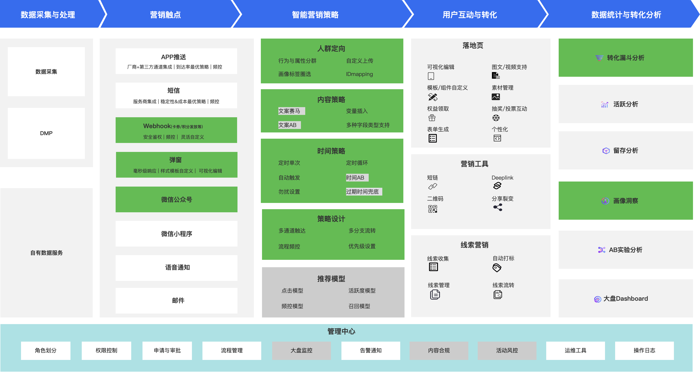
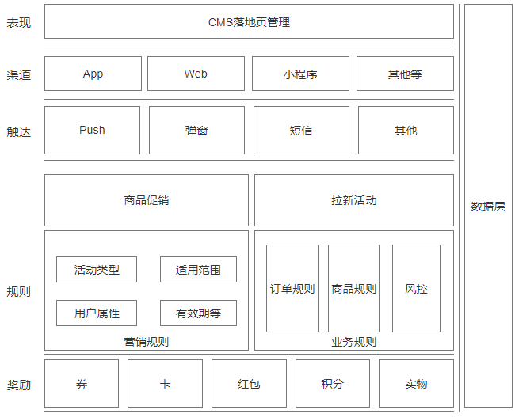

营销是通过探索、创造和传递价值，以满足[目标市场](https://en.wikipedia.org/wiki/Target_market "目标市场")在商品和服务方面的需求的过程。
## 互联网营销
营销本身有着悠久历史，它伴随物物交换而生，随着商业发展而逐渐成熟。如今对人们日常的生产生活产生着不可忽视的影响，是非常常见的事物。受限于各种客观条件，不同区域不同产品的促销形式也多种多样。
在传统营销活动中，主要围绕4P理论进行设计，
随着互联网迅速发展，为了促进用户参与和产品售卖，原有线下的促销手段也被搬到线上。促销形态被进行了”适配“和”改造“，使其更契合互联网这一独特场景。
在移动互联网的迅猛发展的加持下，营销模式也飞速发展，通过网络效应，将营销的作用发挥到了极致。

### 特征
1. 低门槛
	相比传统促销推广需要借助一定“资本”和“渠道”，移动互联网的营销依赖泛社交平台和网络社区，极大降低了推广成本和门槛，”人人都有机会站在聚光灯下“的时代，也意味着”任何产品都有机会发出自己的声音；
2. 网络效应
	在互联网中，人作为网络信息流通的节点，既是传播的目标，又是传播的载体，因此很容易成为营销活动中的一部分，迅速放大营销的影响力，实现指数扩散；
3. 自我过滤
	由于人是互联网内容的消费者和生产者，因此营销内容一方面受节点营销产生话题性，放大了影响，另一方面也由于生产者的偏好，使其过滤部分用户群体，或使其偏移营销主题。

## 营销的本质
**营销产生的本质是由于需求对供给的认知不平衡。** 而营销的作用就是利用这种不平衡，促使需求对供给的相对满足。
移动互联网营销的一大作用是加深加快信息流动。在信息流动过程中，引导转换供需关系，产生收益增长，达到营销目标。
促进信息流动，转换供需关系最主要方式是“利益出让”。利益出让的程度，对营销活动效果影响非常大。

## 营销的目的
对于互联网产品来说，无论是何种营销方式，核心是为了解决两个问题：其一，促进交易增长（利益的流动）；其二，促进用户增长（人的流动）

### 用户增长
促进用户活跃或沉默用户激活，通过话题包装、优惠让利、助力围观等方式，促使人与人连接，引入新用户。优秀的拉新活动常常以低成本的方式，成倍获取用户。 此类活动设计一般围绕留存率、分享率、新增用户量等指标展开。
### 交易增长
侧重实际收益，通过对用户决策流程的刺激、引导、辅助决策，以拉动用户消费为最终目的，围绕 GMV、订单量、复购率等核心指标进行设计。

因此，往大了说，制定营销战略；往小了说，策划日常活动，任何营销方案的在设计和执行落地中，首先要明确的是营销目标。所有营销行为都应紧紧围绕关键目标展开。
聚焦目标，基于目标做设计，也有助于我们在任何时候都清楚什么是最重要的，权衡利弊，做正确决策。
## 什么是营销系统
### 概念
本书所提及的营销系统，是指为满足互联网各业务的具体营销诉求，开发设计的各种功能模块或组件，这类功能交织耦合所形成大系统。该系统在互联网平台中（尤其是电商平台和 O2O 平台）承接各类促销活动，其功能模块包含前、中、后台，不同模块承担的任务不同，互相支撑联动构成营销系统。

传统营销学所指的宏观营销体系不做详细叙述，文中所描述影响营销相关重要因子，也是微观层面的重要影响因素，4P 等营销理论不在。

一句话概括，本书所指的营销系统是集活动、卡券、规则、奖励、数据等促销前中后台模块为一体的系统解决方案。

后续将按此架构，以几个章节叙述互联网营销系统设计。

### 产品架构
一般来说，一个互联网平台完整的营销平台应该包含以下几个维度：
- 线索层：信息收集、信息管理（标签管理）、线索流转
- 策略设计：包含活动、促销、奖励等
- 用户层：标签设计、用户画像
- 触达模块
- CMS 内容搭建
- 数据层：数据分析、用户洞察、A&B test

### 误区
不同公司，由于各种原因对营销相关功能认识存在差异，有的是运营系统下的促销模块，也有的独立成为营销中台，服务多条业务线等。这也造成了不同业务方对营销系统认知存在差异。
营销系统不仅仅优惠券系统。优惠券系统仅是营销活动中奖励层的模块，是营销系统中的子系统；
营销系统就不是固定的一成不变的产品模式。它依赖于所覆盖的业务特性，依托于现有平台，并呈现出不断革新的特性。
营销增长不是一蹴而就，真正有价值的营销总是与产品互相赋能，用户与业务多方受益。实现这一目标的前提是，我们需要非常深入的了解我们的产品和业务模式，了解我们的用户。

## 资料参考
- [Marketing - Wikipedia](https://en.wikipedia.org/wiki/Marketing)
- [Marketing mix - Wikipedia](https://en.wikipedia.org/wiki/Marketing_mix)