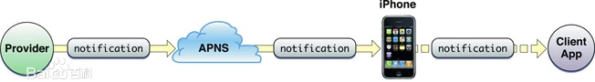

## 说明
Push，又称 App 消息推送，是移动互联网营销中应用最广泛、最频繁的用户触达方式。
其运行机制简单来说，业务部门可以通过 push 后台创建一条消息，经服务器转发，将内容直接呈现在用户手机上。

[pushios](attachments/pushios.png)

这种触达具有以下几个特点：
- 低成本：接入和使用费用成本整体比其他通知消息低
- 便捷：通过 push 平台可以快捷方便地创建消息
- 低依赖：只要用户安装设备，就能有效通知，不需要获取其他隐私（如手机号、邮箱）
- 高连通率：即使 App 没有在前台运行，只要消息接收开启，就能有效通知用户
- 普遍：当前基本所有手机系统都已经内置消息通知模块
- 低延迟
- 推送量大

## push 的原理

一条消息是如何推送到你的手机上？

简单说，通过在运营后台编辑一条内容消息，经应用服务器转发给手机推送服务器，完成消息中转，最终呈现在用户设备上。这个中转过程即推送通道，不同机型、不同系统推送通道不同。
App 需要接入推送通道以实现消息推送功能。根据实际需求，推送服务主要有以下几种类型。

## 推送通道
### 系统级推送服务
iOS：APNs 服务
APNs(英文全称：Apple Push Notification service），中文：苹果推送通知服务。该技术是由苹果公司提供的 APNs 服务。
APNs 适用于搭载 iOS 、macOS 系统的设备，如 iPhone、mac 等。所有消息都需要经 APNs 服务完成消息最终送达。

Android：GCM 服务
GCM(英文全称：Google Cloud Messaging)，是由谷歌推出的云推送消息服务。
GCM 适用于搭载 Android 系统的设备，如三星、索尼等。

接入系统级推送服务无论从稳定性、到达率和用户体验等方面都是优选。

### 国内厂商通道
对于面向国内市场的应用来说，由于 GCM 服务受到防火墙屏蔽，国内基于 Android 系统开发的手机都无法使用 GCM 推送。因此在国内 Android 生态中，推送通道都是由终端与云端之间的长链接来维持，这种方式严重依赖于应用进程的存活状态（即 App 是否在运行）。

如今一些手机厂家会在自家 rom 中做系统级别的推送通道，再由系统分发给各个 app，以此提高在自家 rom 上的推送送达率。

主流厂商推送服务：华为、小米、vivo、OPPO
 [待补充](待补充.md) ，这里可补充各厂商链接

App 接入厂商推送后，应用服务器消息会经厂商推送服务器，转发到用户设备上。由于系统定制开发，厂商推送不仅整体消息到达率较高，而且消息类型和样式也较为丰富。

- 推送的限制
    - 为了提升用户体验，厂商服务将消息分类成系统通知消息和运营营销消息两大类，并进行数量和频次的限制。参考如下（数据源截止 2021 年 10 月，最新数据可参考各厂商官网推送政策）
    - [[待补充]]， [参考链接](https://docs.jiguang.cn//jpush/client/Android/android_3rd_qps/)

### 第三方推送服务商
对于面向国内市场的 App 平台来说，客户端需要接入各家厂商服务才能保证消息到达，不仅开发成本较高，数据维护管理也比较麻烦。因此绝大多数 App 都选择接入第三方推送服务商 SDK ，作为 push 推送解决方案。

常见的第三方推送服务厂商有，极光、友盟、信鸽、个推。

在推送时，客户端推送 SDK 会根据用户设备号生成一个对应关系的 TOKEN，作为推送用户设备的唯一标识 ID，推送通道更换 TOKEN 信息作废，对平台来说是一个比较伤的事情，因此在第一次搭建推送模块时，最好评估清楚接入哪个平台。

- 弊端
    - 这种接入虽然较为便捷，但它的推送通道依赖长链接维持，需要 App 存活，不仅消息到达率低，且费电；
    - 推送厂商的保活策略：为了使 App 存活，需要接入同类服务的 App 互相激活唤醒，在越来越重视隐私的今天，较为敏感；同时手机厂商禁止应用互相拉起这类恶意保活策略。
    - 这种保活方式也依赖同一设备下，接入此类推送服务的 App 覆盖量；

- 优势
    - 第三方推送基于长链接，对推送总量和频次都没有限制；

- 厂商集成
    - 为了降低这种弊端的影响，第三方推送都集成了厂商通道。当消息推送时，优先走厂商通道，如果厂商通道失败，在通过第三方长链接尝试推送。

## push 的能力
[[待补充]]
