# 白鸦内部培训：企业服务类产品的底层逻辑，和“有赞产品设计原则”

原文：[https://mp.weixin.qq.com/s/-kLQPDU-9337mN1ebjuYqA](https://mp.weixin.qq.com/s/-kLQPDU-9337mN1ebjuYqA)

[《有赞产品设计原则》](https://design.youzan.com/product-principle/principle.html)

- 全文 16517 字，阅读需 30 分钟以上。

## 有赞产品设计原则

**写在前面**

作为一个产品团队，我们最需要的永远都是懂用户懂需求，并保持不断的创新力。有赞希望每个产品人在这里都能足够发挥自己的能量，为客户创造价值，并获取价值。

于是，我们需要一个大家共同理解、遵循、迭代的《产品设计原则》，从而保障我们可以在不偏离的情况下肆意挥洒、充分创新。

**原则概要**

有赞的《产品设计原则》，根据客户需求、有赞的使命和愿景、当前生态环境，以及我们所处的发展阶段拟定，它是每个有赞产品在设计过程中都要遵守的基本原则。我们还会定期对其进行优化和迭代。

它是一个产品视角的原则，并非完整的市场、运营或者技术视角。在产品视角上，我们把产品设计过程分成了 4 个部分：产品定义、产品设计、产品研发、产品运营。

- **产品定义：** 首先是定义客户和场景，面对什么样的客户，服务什么样的场景，它的使用场景是什么；然后是价值，客户价值和商业价值；再是全局，要做全局的整体的思考。

- **产品设计：** 基于场景拆分用户的使用任务，任务再会拆分为功能和交互、内容和信息架构，最终把它呈现到界面上。

- **产品研发：** 主要指界面设计、技术研发，还应该有用户体验及可用性测试的部分。

- **产品运营：** 产品上线前后的基于产品的运营计划，产品的增长管理、市场营销、跟用户之间不断的互动过程。

这 4 个部分不断循环迭代，就是整个产品设计方法的过程。在这个过程中有赞的产品设计原则如下：

**产品定义**

**1. 用户和场景是一切的基础。**

清晰的用户画像和使用场景，是整个产品的基础条件。

**2. 找到用户价值和商业价值的结合点。**

定义一个新的产品时必须找到用户价值和商业价值的结合点，同时能够满足用户价值和商业价值的需求通常是最优质的需求。

**3. 设计可持续正向增长的产品模式。**

产品模式应该是可持续的、长期的、正向增长的，随着用户的使用，产品价值会越来越高，业务增长会越来越好，成本增长不断下降。并且，给老产品带来正向增长的新产品，要比只利用老产品来补给的新产品要好。

**产品设计**

**4. 首先要是能够最小可用的全场景闭环。**

商家端的产品要做成全场景、完整业务链路的闭环，因为任何一个环节的缺失和不完善都会导致商家的生意无法正常运转。

**5. 每个商家都应该是独立的个性化的。**

本质上我们的服务是“在云上为每个客户提供了一个独立的产品”，商家都是独立的，每一个商家都有个性化配置一切的权利。我们要尽全力去实现每一个商家的独立和每一个商家的个性化，而不是规定他们一定要怎么样。

**6. 产品结构及呈现方式需要可延续可拓展。**

一个被信任的商业服务产品首先应该是持续稳定的，产品的结构和呈现方式一旦确定下来，就不能轻易改版。这要求我们的设计需要面对业务变化的时候可延续，面对功能和服务增加的时候可拓展。

**产品研发**

**7. 稳定压倒一切。**

没有任何东西比 SaaS 的稳定重要，宕机了再好的产品都没用。会影响到系统稳定的事情不能做。

**8. 说人话。**

说对方能听懂的话，做用户能用明白的产品。不耍专业，不设置门槛。

**9. 永远保持一致的表达方式。**

每一处给用户表达的内容，都需要是一致的，不做多样化。从开始到结束，从 A 产品到 B 产品，从界面视觉到文字内容，以及标点符号。

**产品运营**

**10. 不可减少，每个用户都重要。**

新产品不能比老产品的功能少，不应该轻易下线产品功能，不降低服务。不让少数服从多数，每个用户的需求和习惯都是重要的。

**11.先有，再高效，然后易用，最后好看。**

有是最基础的体验，有总比没有要好。然后使用效率要很高，再然后才是要好用易用，最后才是要好看。当然，丑也是不行的。

**12. 持续关注自己的“孩子”，哪怕她已经嫁人。**

作为一个产品人，应该持续关注自己做过的产品，哪怕这个产品已经不归自己管了，也应该经常关注并思考他的发展和进化。

**13. 不骚扰用户，不群发。**

我们的责任是帮助商家成功，不是为了让我们自己的生意更成功，我们没有权利去为了自己的商业目的不断骚扰用户。用户通常不看系统消息，群发信息起不到沟通作用。

**一些常识**

- 没有人会看公告。

- 没有人会看系统消息和群发短信。

- 几乎没有人会改默认设置。

- 习惯路径的设计，比少一次点击重要。

（完）

2019.07 版

## 有赞产品设计原则内部培训音频

**以下是白鸦在有赞内部关于《产品设计原则》的分享速记：**

在有赞产品设计原则这件事上，我们想了很久。有赞最早期的时候，产品的设计原则主要靠我和麦麦（有赞首席产品设计师）等几个人的默契，以及慢慢形成的习惯。我们天天沤在一起天天聊，然后就有了一些共同的产品观，以及产品设计的习惯和理念。

但是，随着我们的小伙伴越来越多，我们注意到有很多东西，都要再重新给每一个人讲一遍。坦白说，所谓的产品设计原则或者产品观，并不是全世界通用的。每一个公司、每一个团队，因为业务性质和业务特点的不同，（都）可能会出现他的产品设计原则跟别人的不一样。

所以我首先要说，产品设计原则这件事，没有谁是最好的。只有你的产品设计原则是否最适合你的业务，最适合你的产品。因此，我们发现很多新的同学带着原来在其他公司、其他岗位上的设计原则、设计思想，加入到有赞这家公司之后工作中有一些不适应，你不知道我们在产品设计时为什么会那么想。甚至我发现新来的同学经常会犯一些我们认为在这个业务性质上，在我们的原则上，我们的价值观上不应该犯的错误。

所以我们（又）花了很久的时间去讨论有赞的产品设计原则，去一个一个的想（推敲），最后把它确定下来，专门做这次的分享，而这次分享只是我们开始落实有赞产品设计原则的一个 kick-off ，之后我们还会把这次分享的内容再细化做出案例，然后对公司新入职的每个产品经理进行考试，如果考试不过关是没有资格转正的。因为有赞产品设计原则是这家公司与用户的基本原则，这些东西我们要保持一致。

我举个有意思的例子。我们经常发现新来的同学在优化产品的时候，他会发现某个功能可能有一点臃肿（麻烦且没什么人用），然后就把这个功能下线了。如果是   to.C   的产品，把某个功能下线是很正常的事情，比如微信去年上了一个可以去看最近三个月谁没有联系，最近半年谁没有联系的功能，上线了一个版本后，下一个版本直接就删了。  to.C   这样删是没问题的，但是   to.B   的产品你不能删，我问新来的同学你为什么把它删了？他说我看了一下数据，没多少商家用，于是就把它下线了。我要强调在   to.B   的产品上不能这么删，原因很简单，哪怕只有一个商家用，你都不能下线。如果这个产品有危害你不得不下线，你要么做一个高级功能把它替换下去，要么就（得先）跟商家沟通说：我们打算把它下线，对你有影响吗？这是一个基本的   to.B   的产品设计原则，非常非常基础的原则。

不仅仅是因为你要坚持这样的原则，甚至从法律上说你都应该有这样的责任。因为商家在购买你的系统和你签协议的时候他买了那个功能，而你把那个功能拿走了，你就是没有很好的履约，你负有法律责任，说严重点就是这样的。

**另外，我们的产品设计师如果依据“大部分商家”和“一般情况下”去规定产品设计，也是一个坏习惯。**

比如，“一般情况下商家的签到活动都是持续的”，于是产品设计师就把“奖品被抢完”写成了“奖品被抢完，下次早点来”。这是个典型的坏习惯案例，“下次早点来”不只是多余的，还是错误的。如果某个商家的活动就这一次呢，你强行加了一个“下次早点来”对这个商家来说不就是个 bug 吗？还是那句话：不能因为多少商家都这么用，我们就要求所有商家这么用。

但是今天在中国几乎没有成熟的 to.B 产品经理，所以大部分的同学没有这样的习惯，来了就把功能下线了。然后每次问，每个人都要重新说一遍，不厌其烦。所以我们今天就专门把所有产品经理叫到一起说一遍。说完了我们还会把内容做成手册，大家可以理解，这就是有赞产品设计的法律，我们会把它上升到非常高的高度来看待这个问题。

有赞这家公司的所有做事方式、所有思考，以及所有出发点，都是基于我们业务。而我们的业务是基于什么？我们的战略又是基于什么？都是基于我们长期的使命和愿景，所以我必须要给大家回顾一下有赞的使命和愿景。

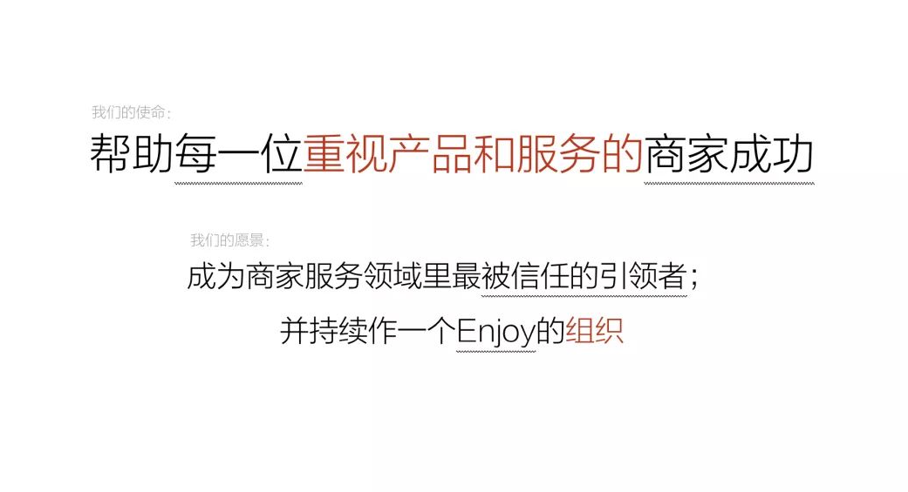

我们的使命是帮助每一位重视产品和服务的商家成功。“每一位”和“商家成功”是我们最重要的关键词，我们要服务的是每一位商家，然后帮助每一位商家成功，但是为了整个生态的健康，那些不重视产品和服务的商家，我们是（可以）不服务的。所以我们在产品设计原则上，在产品做一些功能的选择上，如果这个功能做完了会导致商家不重视产品和服务，我们是不会/能做的。

举个例子：消费者购买之后（可以）有一个评价，我们的购物评价是要么开启要么不开启这个功能。我们不接受商家去删购物评价，因为商家一旦可以删了消费者的差评，他就（很可能）不会那么重视产品和服务了。所以有赞永远不会提供删除商品评价的功能，商家要么就不开启。可以不用，如果要用就要接受有人说你不好，商家可以去跟消费者沟通，沟通完了消费者自己改，但是我们不提供让商家删坏评价的功能。所以，这就是最基本的有赞产品设计原则，我们只服务重视产品和服务的商家，我们所有的产品设计原则都是需要这样。

使命是一个很长远很长远的事情，是这个公司活着的理由。而愿景是什么？愿景是我们认为在可见的时间内，我们可以达成的目标。我们在愿景里写了两条：

第一条，成为商家服务领域里最被信任的引领者。因为要成为“引领者”，所以我们对于每一个人的专业性要求很高；因为要成为引领者，所以我们愿意把我们的产品设计规范、产品设计原则、产品界面的东西抛到网上去。大家看到我们在有赞云上直接共享了，直接开源了我们很多很多产品设计的东西，是因为我们希望更多的同行一起探讨一起分享，大家可以随时访问 design.youzan.com (不会拼这个英文单词的产品设计师不是好设计师，哈哈) 。我们愿意接受别人来学，今天大家会看到甚至连一些跟在我们后面的所谓的竞争对手们都在抄我们，大家看到一些“ SaaS ”的操作后台跟有赞长的一模一样。没事，大家在这件事情上胸怀应该开阔一点，因为有赞要做引领者，所以我们就应该有这样宽阔的胸怀，就应该把它共享出去。这也是为什么今天这一场分享会，我们是用“爱逛直播”面向全网直播。我们欢迎所有的同行一起学习一起交流，甚至我们接受所谓的竞争对手来抄我们，因为我们要做引领者。这就是我们自己基于这样的愿景要去做的事情。

第二条，我们给这个组织还定了一个愿景，就是持续作一个 Enjoy 的组织。因为要持续 Enjoy ，所以我们在做产品设计的过程中要好玩。

我们的产品里要想到一些好玩的东西，然后这家公司的氛围也会好玩，我们给商家的活动也会好玩，这是因为我们的使命和我们的愿景。好多新同学不知道为什么有赞这家公司除了清明节什么节都过，因为我们要 Enjoy ，所以是个节我们都会把它弄的好玩一点；这就是为什么我们要用购物直播的爱逛来做这次直播，因为它好玩，这是我们做这些事情的原则。

那么后面我讲到的每一条有赞的产品设计原则都是基于我们的使命和愿景去做的，没有任何一条跟它没有关系，我们所有的思考点都是基于这个出发的，越在有赞这家公司呆的时间长的人，越能理解我们的每一条原则为什么那么做？为什么那么去设计？

说完这些大的原则，我们再去看看面对的情况。刚刚我们说所有的原则都是基于我们的目标和我们面对的业务性质和业务情况、市场情况，那么我们面对的市场情况是怎么呢？我们是什么样的业务类型呢？

我们去看一下今天全世界估值最高的最值钱的 SaaS 公司 Salesforce ，这是 Salesforce 从上市之后到现在的股价，这家公司市值快 2000 亿美元了。

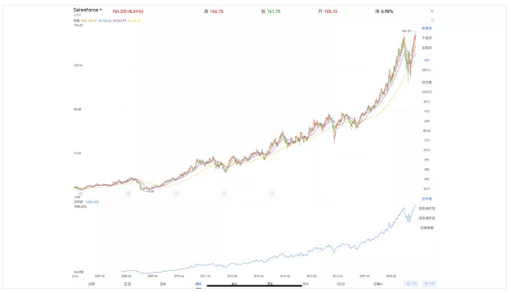

Salesforce 做了十年才上市，上市的前五年股价几乎没动，因为 SaaS 就是这样需要慢慢积累，然后 Salesforce 上线了 force.com ，相当于有赞的有赞云，然后股价开始涨，一路在涨，中间还有个涨是因为 Salesforce 要做 AI ，而且一路涨的这些年里很有意思的是，Salesforce 每一年的收入增长标标准准是 34% ，这是全世界最牛的 SaaS   公司的成长。

我们再看和有赞微商城业务很像的 Shopify 。

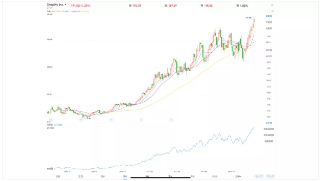

Shopify 做了五年上市，上市后的前三年股价几乎没什么动弹，从 2017 年开始涨，市值也快 200 亿美元了。

一个 2000 亿美元和一个 200 亿美元的 SaaS 公司，早期都是这样。所以我们一直说 SaaS 的业务是什么？SaaS 的业务是：首先要花 5 年以上时间做产品，然后再不断地迭代和优化产品，（因为有赞的使命是“帮助每一位”，所以未来可以有多大的规模对有赞来说非常重要）所以有赞的产品要先服务通用的客户，再服务垂直行业，再服务商家的个性化；再第二个 5 年时间，要同时开始培养销售能力，获取更多的客户赚取更多的钱；然后，再第三个 5 年时间，我们发现所有的 SaaS 公司都在收购公司，最近 Salesforce 花了 190 亿美元收购了一家做数据可视化的 SaaS 公司。为什么要收购其他公司呢？因为你手里有客户了，你就可以给客户卖更多的软件，那些软件不用自己做，可以买，买完以后卖给更多的客户。基本上，每一个 SaaS 公司走完了这十五年，可以躺着再走十五年，这就是 SaaS 的业务类型。

而我们今天在中国市场所面对的不仅仅是像 Salesforce 和 Shopify 这样，需要长时间去做产品，需要很长时间去做服务，做企业服务之外，我们还面对三座大山。

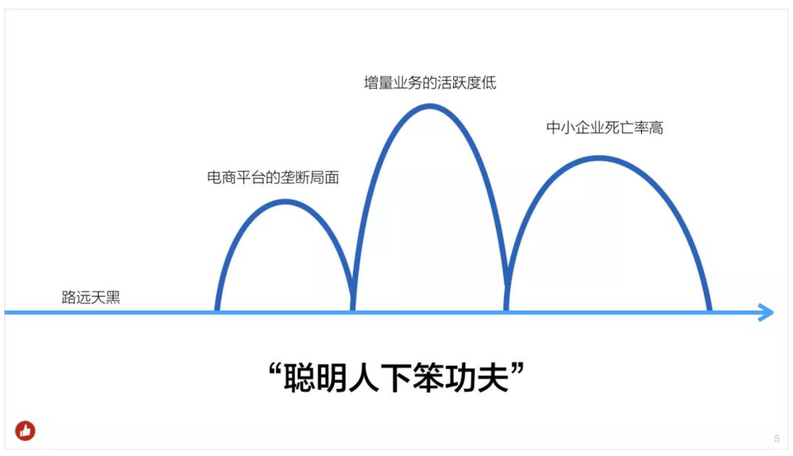

第一座大山，是今天中国电商平台的极端垄断。Shopify 的商家有 50% 的流量来源于谷歌，其中 30% 到了 Shopify 的店里，还有 20% 去了 Amazon 的店里。而在中国，在百度上搜购物相关的词全被淘宝投了广告，所以中国的电商几乎还没有多少来自搜索引擎的流量，因为电商平台太垄断了。所以商家需要“一个有交易功能的独立官网”的能力在过去的很多年成长的非常慢，只有过去的两到三年才看到，中国的商家开始希望有一个自己的带交易功能的官网。这就是最近两三年大家看到的，商家在电梯和公交站牌投广告的时候，除了品牌商有一个搜索框到天猫旗舰店之外，还会有一个小程序的二维码，或者是微信公众号的二维码，然后扫完二维码打开的基本全是有赞的店。我可以很负责任的说，今天在整个微信生态内，真正重视产品和服务的品牌商家的小程序和公众号的 H5 官网， 90% 以上都是用的有赞，尤其是有成交的。为什么？因为，（为了做“被信任的引领者”）我们有很好的风控体系，我们有售后维权体系，今天中国只有这一家公司有超过 100 人的消费者维权团队，只有这一家公司有完整的担保交易体系，只有这样我们才能保障整个生态的健康，才能保障我们的商家是重视产品和服务的。但是这座大山我们跨了很久，还在越。

第二座大山，是商家在购买有赞的时候会认为有赞能给他带来增量的生意（以为用了生意一定会马上就好起来，忽略了有赞是个工具，还需要自己用好这个工具），这是商家购买时候的动机。但是并非所有的商家都能把私域流量运营好，他购买了但他（把有赞）用好的能力不一定够，活跃度不够，这是我们今天在克服的问题，所以我们做了那么多的商家培训，做了那么多的运营指导。

我们是从中小企业开始服务的，（最近一年多）我们开始做大客户以后，每一年的大客户比例都在不断的增加，我们现在大客团队已经有几十人了，明年我们应该有上百人的大客团队，我们会签更多的大客。尤其是有赞云上线之后，我们可以帮每个客户个性化，我们的大客户会变得越来越多。但是（我们的大盘毕竟是中小企业数量最多，这样我们）又要越的第三座大山是什么呢？是中小企业的闭店率、死亡率比较高。你好不容易获得一个客户，他却（因为自己其他的原因把生意做）挂了，你做的再好没太大用，这是我们要越的三座大山。

所以，我用四个字总结，就是：路远天黑。因为路远天黑，因为 SaaS 这个行业是这样，所以我们必须把每件事做的非常认真，我们要把我们的设计原则完全的贯彻下去，很多东西我们要整齐划一的一直能走到那一天，要用非常稳定的产品质量的输出，非常稳定的用户体验质量的输出，这是为什么我们应该比所有的公司都更重视这件事情的原因。所以，这是我经常说的，这家公司产品理念就应该是“聪明人在下笨功夫”。我们知道在什么地方可以耍聪明，但是我们要用的是长期能增长的笨功夫。这是我们的使命、我们的愿景、我们面对的这个行业特点（决定的）。大家会看到在官网上，（我们公布了这些使命、愿景，和价值观）。

一家优秀的公司一家伟大的公司是敢于把对自己的要求和它的使命、愿景、价值观公布在官网上的，因为我们公布了就是让所有的客户来监督我们。我们在官网上没有（直接）写“帮助每一位重视产品和服务的商家成功”，我们写了这个阶段更具象、更能让客户理解的话。

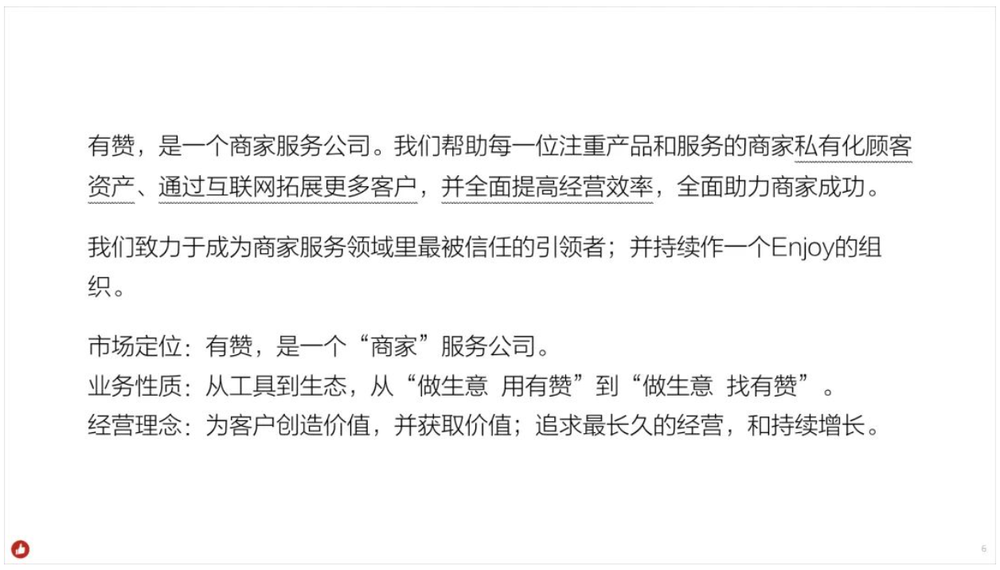

首先我们告诉全社会，有赞是一个商家服务公司，我们帮助每一位注重产品和服务的商家私有化顾客资产、通过互联网拓展更多客户、并全面提高经营效率、全面助力商家成功。为了让客户理解我们把它这样解释了，这是为什么官网上跟我们内部讲的不一样的原因。

然后我们写了我们要致力于成为商家服务领域里最被信任的引领者，并持续作一个 Enjoy 的组织。我们写我们是一个商家服务公司，写我们是从工具开始慢慢做生态，写我们的经营理念是为客户创造价值并获取价值。为什么要获取价值？因为我们要走很远，如果我们不赚钱我们活不到那一天。我们要走很远，所以我们做每一个产品都要考虑客户价值和我们自己的商业价值，我们要追求更长期的经营和追求持续的增长。所有的这些原因，都是因为我们自己的使命和愿景，以及我们面对的环境。

我今天专门再重新讲一遍，是希望每一位有赞做产品的人能理解这每一句话背后的思考和原因。我们再说自己的战略，这家公司会从一个 SaaS 公司变成一个大数据公司，变成一个人工智能公司。

我们有电商 SaaS ，除了电商 SaaS 我们还做了门店 SaaS ，然后我们在做有赞云，我们在尝试分销、尝试有赞支付、尝试有赞金融、尝试有赞广告业务，我们未来有更多的增值业务，这是我们一直在走的业务。我们今天在门店 SaaS 的业务刚刚开始，所以我们还有很远很远的路要走。

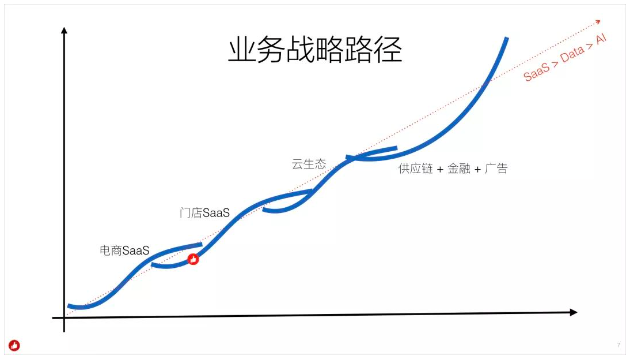

基于前面这些大背景，你会看到这家公司的所有的思考方式和思维理念，就是我们要给我们的客户提供解决方案，来帮助我们的客户在生意上成功。我们的客户成功了，我们可以通过客户的介绍获得更多数量的客户。因为我们服务了更多数量的客户，我们才能更理解客户的需求。因为我们更理解客户的需求，我们才能把解决方案做的更好，把解决方案做的更好，客户会更成功，我们一直在围绕这样的一个正向循环，在做我们所有的布局、所有的思考、所有的产品、所有的投入。

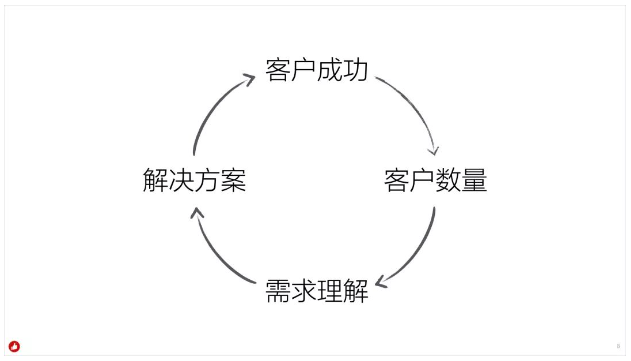

所以你会看到，这家公司只会通过解决方案帮助客户成功来获取更多的客户，不会在市场上拼命打广告，不会在市场上拼命做补贴来获取客户。为了帮助客户成功获取更多客户的目的，是为了我们更理解客户的需求，所以我们更要重视今天已经付费客户的需求，我们不是不重视还没有付费客户的需求，我们更重视（付费商家的需求）是因为要理解现在商家的需求，把它做好，然后再去丰富解决方案，然后再来服务更多的客户，这是我们整个的经营理念。原则上，从有赞云正式上线之后，我们不接受客户说“我的需求你们有赞满足不了”。满足不了只是时间问题。

这就是我们想要做的事情，这就是这家公司整体的思考方式和整体的设计理念。这个东西不只是产品在考虑的问题，也是公司的整个服务体系、销售体系、产品运营体系、技术体系以及包括 HR 体系、财务体系都在用这样的思维方式考虑所有的问题，这是我们整体的东西。

接下来我们再来说我们的设计原则，来的早的同学都见过这个设计原则，这是我们最早定的一版很粗的设计原则。设计原则是：说人话、产品应该是低门槛的、产品尽量让商家可以配置、产品要做到最小可用、所有的产品表达是一致性的，每一个商家尽量独立。

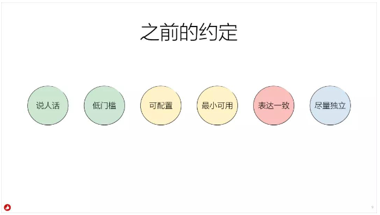

这就是我们第一版的设计原则，接下来我要开始说未来几年有赞的产品设计原则。

我想强调一下，刚才前面的内容是全公司视角的。

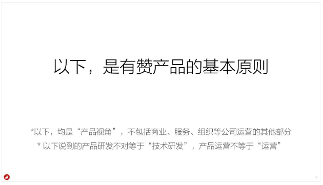

公司每一个人的视角和思考方式。所以，接下来所有内容都是“产品视角”。它不包含我们的商业体系和服务体系的视角。接下来我会提到产品研发，产品研发不是指技术一定要这么干，是产品研发那个阶段要做的东西。也会讲到产品运营，也不是说运营部门一定要这么干，是产品人在产品视角上应该怎么考虑（运营）问题，应该是什么样的原则。

在说产品设计原则之前，我先说基本的产品设计方法论。有三个部分。

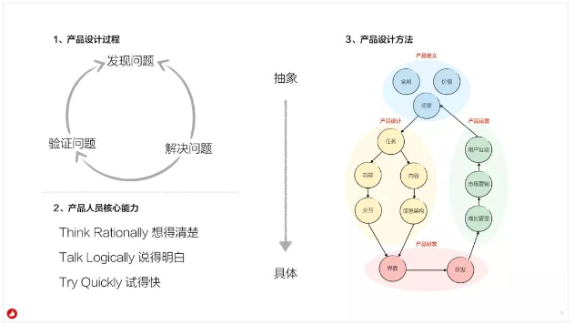

第一部分，是产品设计的逻辑，发现问题、发现客户的需求，然后去解决问题，然后再去验证这样的问题有没有被解决，验证完问题之后去发现新的问题，再去解决问题。所以每一个产品人在做的事情，其实就是发现问题、解决问题、验证问题的整个过程。

第二部分，是产品人应该知道自己的核心能力是什么？产品人的核心能力有三个：

**第 1 个是一件事情能把它想清楚。** 任何一件事发生了，你能不能想到它底层的原因是什么？它的根本是什么？

**第 2 个叫说的明白。** 因为产品是整条线的那个牵头人，如果一个产品人不能把你的想法这件事情的东西说明白，就是能力很差，不存在表达能力很差的产品经理。有人说张小龙的表达能力就不好，那是你们没见过他讲产品逻辑和思考的时候表达能力有多好。（“不善”演讲不代表表达能力不好，要的是把自己的思考清晰表达出来的能力，而非煽动能力）。

**第 3 个是要有能力快速的去试。** 这个试包括但不限于把产品搞上线让用户来用，也包括了可能做一个粗的原型，也包括了可能去做访谈，去做客户的沟通。

**然后再说产品人的设计方法，有赞的《产品设计原则》，根据客户需求、有赞的使命和愿景、当前生态环境，以及我们所处的发展阶段拟定，它是每个有赞产品在设计过程中都要遵守的基本原则。我们还会定期对其进行优化和迭代。我们把设计方法分成了 4 个部分：产品定义、产品设计、产品研发、产品运营。**

- **产品定义：** 首先是定义客户和场景，面对什么样的客户，服务什么样的场景，它的使用场景是什么；然后是价值，客户价值和商业价值；再是全局，要做全局的整体的思考。

- **产品设计：** 基于场景拆分用户的使用任务，任务再会拆分为功能和交互、内容和信息架构，最终把它呈现到界面上。

- **产品研发：** 主要指界面设计、技术研发，还应该有用户体验及可用性测试的部分。

- **产品运营：** 产品上线前后的基于产品的运营计划，产品的增长管理、市场营销、跟用户之间不断的互动过程。

**这 4 个部分不断循环迭代，就是整个产品设计方法的过程。在这个过程中有赞的产品设计原则如下：**

### 产品定义

第一个，产品定义的产品原则。

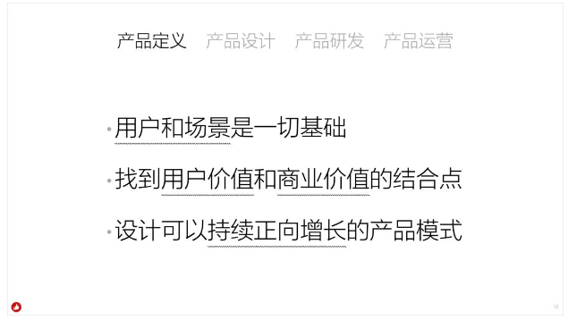

**第一点，用户和场景是一切的基础。**

**清晰的用户画像和使用场景，是整个产品的基础条件。**

在有赞做产品，如果你不能说清楚这个项目你思考的核心使用场景？它的用户画像？你什么都不可能做好。所以用户画像和使用场景是最基础最基础的东西。

**第二点，找到用户价值和商业价值的结合点。**

**定义一个新的产品时必须找到用户价值和商业价值的结合点，同时能够满足用户价值和商业价值的需求通常是最优质的需求。**

你在定义一个新的产品时必须找到用户价值和商业价值的结合点，不是所有的用户需求都要今天满足，因为如果那个用户需求跟商业价值之间不能契合上，它的优先级可能就会被降低。

我们去做一件事情，这件事情有两个轴，一个轴就是用户价值，一个轴是商业价值，我们要找到这两个轴里最契合的那个点，然后那个事情的优先级才是最高的，这就是最基本的原则。

举个例子：假如微信公众号的应用很浅，要点公众号菜单打开一个 H5 ， H5 的交互也不那么好。如果把它搞一堆组件，把它做成原生的小程序，那体验是不是更好呢？做了小程序之后，用户的记录还能够被留存下来，还能找到用过的小程序，小程序的内容还可以被很多人搜索，那是不是更好呢？这是基于用户体验来说的。但是基于用户的体验和用户的价值之后，是不是一定要做它，还要考虑对于微信的商业价值是什么，让用户的体验更有粘性？让场景能扩张？（商业上可以）让内容更封闭在微信的生态内？商业上打造一个新的闭环游戏生态？我们不知道这些是不是腾讯真实在考虑的决策原因，但我可以肯定每一个决策的背后都是基于用户价值和商业价值这两个点。

有赞做所有的事情，决策的背后也是基于这两个点，有很多客户提各种需求，我们应该先看客户是谁？画像是什么样子？这些需求的场景是什么？满足这些需求的价值有多大？然后再看如何在这件事情上获取商业价值，商业价值不代表一定是钱，它可能还有更多商业可期的东西。所以，任何决策的背后都应该是这样，如果做一件事只能给用户创造价值，商业价值是损失的，这件事优先级一定不高；如果一件事你只能够获取到商业价值，对用户是没有价值的，这件事情可以不做，这是有赞这家公司的基本原则。

**第三点，设计可持续正向增长的产品模式。**

**产品模式应该是可持续的、长期的、正向增长的，随着用户的使用产品价值会越来越高，业务增长会越来越好，成本增长不断下降。并且，给老产品带来正向增长的新产品，要比只利用老产品来补给的新产品要好。**

你不能设计出来一个产品，那个产品是负向增长的，要设计一个产品让用户用完之后会有更多人来用，会带动更多的正向的收获，会获得更多正向的需求，会带动更多正向的收入，会带动更多正向的客户成功。而如果你做一个产品，只能解决短期的问题，不能长期正向循环正向增长，那这就不是一个好的产品。我们做任何一个产品任何一个功能任何一个业务，它都应该是可持续的、长期的、正向增长才是最好的。

### 产品设计
在产品设计阶段，有三个产品设计原则。

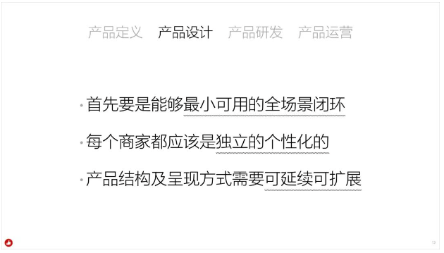

**第一点，首先要是能够最小可用的全场景闭环。**

**商家端的产品要做成全场景、完整业务链路的闭环，因为任何一个环节的缺失和不完善都会导致商家的生意无法正常运转。**

这里的关键词是“最小可用的全场景闭环”，最最关键的词是我们和 to.C 场景完全不一样的，就是“全场景闭环”。to.C 的场景不是全场景闭环，你会发现做 to.C 的业务经常会出现：要做一个业务，大家开始一起头脑风暴，认为要搞 100 件事，然后这个业务搞了 10 件事就敢上线了，上线就开始运营了，然后过了几年公司都赚了钱了，业务都跑很顺了，有很多用户了，当年的 100 件事才只做了 30 件，其中有 20 件是在那 100 件事里面的，还有 10 件可能不是那 100 件事里面的，是别的地方的。这就是 to.C 产品，可以快速迭代，小步快跑。而 to.B 的产品最小的那个快速迭代也得是全场景闭环的，想做一个 to.B 的业务，然后列了 100 件事，对不起请先做够 90 件，不做 90 件不是闭环不能上线。

举个例子：我经常讲的，就是我们最早做收银的时候，第一版没有挂单功能（挂单：消费者买单到一半，要去选购别的东西；收银员把订单先挂着，让后面排队的人继续买单；消费者拿好东西回来再“取单”），想一想一个收银的产品如果有 100 个功能，挂单能排到前三十吗？能排到前二十吗？（不能）。于是我们犯了一个错误，就是没做挂单功能就上线了。然后被客户骂的要死，说你们做的什么狗屎产品？连挂单都没有。然后（我们）问客户挂单重要吗？客户说重要啊！这就是做 to.B ，必须要做到的。

然后我们做了一个挂单只能挂 1 单，客户又骂，“什么狗屁产品只能挂 1 单”！我们问：经常挂很多单吗？客户说“偶尔要挂很多单”。

挂单的场景就是你在超市排着队买东西，结账的时候需要再买个东西，收银员把你的东西放一边，后面的人先结账买单，把你的单选择挂单，等你把东西拿回来之后，她再把那个单取出来，扫个码再把之前的东西放进去一起买单，这叫挂单。这场景丰富吗？排的优先级高吗？不高，但是你没有，这个产品就不能上线。

这就是 to.B 要做全场景、完整场景的闭环，如果你做不到完整场景闭环你都不好意思上线。所以在这家公司，大家千万不要带着 to.C 的思维来做产品的初期那个最小可用，那个初期的最小可用上线了，商家骂一顿走了，销售白忙活了，等再去卖的时候商家说哎呀有赞我知道，很烂的，收银连挂单都没有。所以一定要把闭环做完，做 to.B 就必须要这么干，我希望大家能理解。

**第二点，每个商家都应该是独立的个性化的。**

**本质上我们的服务是“在云上为每个客户提供了一个独立的产品”，商家都是独立的，每一个商家都有个性化配置一切的权利。我们要尽全力去实现每一个商家的独立和每一个商家的个性化，而不是规定他们一定要怎么样。**

软件最早都是单机版，即使今天我们做了 SaaS ，其实也只是在云上给每一个客户提供独立的软件，所以每一个客户的商城都是独立的，每一个客户都有个性化他的商城的权利。如果成本可控的情况下，每一个功能都应该是可配置的，有的人想把购买叫“立即购买”，有的人想把购买叫“拥有它”，你就应该让他可以去定义购买按钮的文案。to.C 没有人这么想过（因为一个产品都应该是一个统一意志），但是 to.B 就应该是这样，每一个商家都是独立的，每一个商家都有个性化的权利，你要尽全力去实现每一个商家的独立和每一个商家的个性化。

我见过很多 to.B 的产品上来就死（不被接受），就是因为他们不懂这样的基本理念。比如，商家说我有这个需求，然后产品经理说你应该那么用，请问谁规定商家必须要那么用？

我给大家举个例子：我给企业微信的产品经理说了好多次。我说企业微信能不能有标记未读？原因很简单，麦麦给我发的一条信息我看了，我判断需要找一个稍微空一点的时间花几分钟回复他，我标记一个未读，随后再找回来回复他。企业微信的产品经理回复我说：企业微信里有个功能叫待办事项，你应该把它加入到待办事项。我很无语。

这就是不会做 to.B 产品的人的思维方式，他希望和规定用户的行为，但是 to.B 不应该这么干。微信可以这么干，但是企业微信就不该这么干，这是基本的 to.B 的思维。

**第三点，产品结构及呈现方式需要可延续可拓展。**

**一个被信任的商业服务产品首先应该是持续稳定的，产品的结构和呈现方式一旦确定下来，就不能轻易改版。这要求我们的设计需要面对形势变换的时候可延续，面对功能和服务增加的时候可拓展。**

一个好的 to.B 产品，有赞微商城的产品后台界面结构、产品架构，从 2015 年开始就没有改过了。2015 年我们上线的时候就说我们要上线一个版本，这个版本的产品架构在未来永远不改。一个 to.B 的产品不要没事折腾改版，改版了客户就不会用了， to.C 产品要搞点花样，有点争议没关系， to.B 产品（没事儿）不要动它。所以很多人知道，这家公司如果你要改商家管理后台的导航必须我通过，是因为我不希望你改。

因为它需要一直可延续，那么它就要求你在设计的时候是纵向的，竖着的导航，因为它有拓展空间（竖着有滚动条，横着没有）。

还有我们的很多产品经理不理解，为什么要坚持有赞微商城的后台概况、店铺、商品、订单都长这样，商家会那么找吗？我告诉你：只有中高端商家会跑到里边二级导航找，大部分商家都会从首页点击，商家基本上不太会理解你的架构，所以我们那个产品架构是给谁用的呢？是给在座的有赞产品经理们用的。为什么？因为让你不要乱放，告诉你商品就放在商品这里，订单就放在订单这里，店铺就放在店铺这里。（确保这个产品有一万个功能的时候产品结构还是稳定的，常用的东西在首页可以找到，不常用的在二级导航里面可以找到，或者直接搜索到。）

所有的导航和所有的内容，都应该是商家的生意，你不要去抢他的，而我们跟商家之间的生意，放在设置里面，设置里面有一个专门的版块是我们跟商家之间的关系，剩下都是商家自己管理自己的生意，我们在给商家做的是一个工作台，整个有赞打开概况页只有内容区左上角你买的什么版本，是有赞跟他之间的生意。设置里面二级导航最下面的有赞服务，是有赞跟商家之间的关系，剩下都是商家自己的，你不要搀和进去。

举个例子：最早我们把商家交的保证金，商家在有赞这里还有多少有赞币，都放在资产里面了，这是不对的。资产是他的生意，不是你给他的东西，这是我们要做的规范。这些规则，商家懂吗？他不懂，他在乎吗？不在乎，在座的各位必须在乎，因为今天你有这么多功能，未来有一天这个产品有一万个功能的时候，你现在开始不在乎，未来就崩了。

我有一个做证券软件的朋友，去年我在南京做产品培训的时候他来找我，说白鸦我准备给我的软件改了，我的后台得改了，没法干，我们有一万个功能，太他妈难用了，我准备改它，改的倍儿简洁。我说：别，不需要那么简洁，需要稳定，因为你有那么多功能甩不掉，是因为你要服务那么多的客户，就需要那么多的东西，所以你需要一个稳定的产品架构。

还有为什么你们会发现，我们的后台看不出来是我们的后台，因为我们没有在我们的后台放有赞 logo 。很多软件公司，把左上角的 logo 放成自己公司的 logo ，神经病啊，一个商家在他的后台天天看有赞的 logo ，他为什么要看见你的 logo ？他不需要看见你的 logo 。我们的 logo 在哪？我们的 logo 在内容区最底下灰色放在那，那是一个版权声明而已。

这是我们做事情的原则，因为你要考虑你的用户要什么。还有比如阿里妈妈，然后你会发现阿里妈妈的后台花里胡哨的，阿里妈妈的每一个（商家后台）产品长的都不一样。天啊，一个商家的广告投放后台搞那么多花样干嘛？

所以我们前天又梳理到凌晨两点多，然后规定接下来我们给商家用的 SaaS 产品，所有的布局方式都必须一致，左右布局，然后一级导航、二级导航、三级导航内容区规则必须一模一样，因为任何一个商家用有赞的所有产品，习惯应该保持一样，你不要让他用 A 产品用 B 产品用 C 产品都要重新学习一遍，这是不行的。

不过，我们的广告投放后台、商家资产的后台，它是一个平台型产品（这不是商家管理自己店铺和消费者互动的后台，而是商家跟有赞之间互动的后台），虽然也要保持左右布局保持体验一致，但是我们要做品牌露出，因为要声明你在用有赞支付，这是你在有赞支付的后台，你在管理你在有赞支付的资产。

有赞以后给商家所有的后台产品都必须左右导航，不接受上下导航，只有这样商家用我们所有的产品的习惯是一致的，学习成本是最低的。这就是我想说的：产品结构和呈现方式需要可延续可扩展。

### 产品研发

然后我们再说产品研发，今天主要说界面。

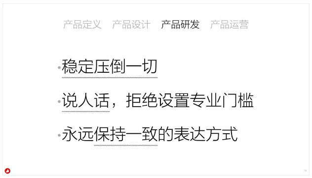

**第一点，稳定压倒一切。**

**没有任何东西比 SaaS 的稳定重要，宕机了再好的产品都没用。会影响到系统稳定的事情不能做。**

如果你要做一个功能，这个功能可能会影响到系统的稳定性，不要做。因为没有任何东西比 SaaS 的稳定重要，如果你宕机了，你做的再好都没用。

这也是为什么这家公司应该是全世界唯一一家把耻辱时刻会出现的东西做成吉祥物的原因，为什么霸王龙是有赞的吉祥物？为什么办公区里都是霸王龙？是我们想提醒每一个人：稳定是 SaaS 的第一要务！宕机了你什么都不是，你不能宕机，所以稳定压倒一切。

如果你做一个产品，产品（呈现上）也要稳定，而且这个稳定应该在方方面面持续保持。商家为什么觉得你靠谱？你怎么样做到最被信任的引领者？你怎么做到最被信任？我们今天说一个商家靠谱，那家店在那里开 10 年了口味没变过，然后你觉得他靠谱，对不对。

正是因为这样的原因，所以我不希望我们今天变明天变。所以这也是为什么我们每年两场发布会是固定的， MENLO 在五月初，年底有感恩答谢会。 MENLO 发布会所有的设计主题都一定围绕着电灯，可以每年换个电灯的创意，但是必须是围绕着电灯，这故事要持续讲下去，才会稳定被信任。MENLO 发布会的门口一定会看到爱迪生的那张图片，这就是我们要做的，一定会在整个 MENLO 发布会的地方能看到那个灯塔的图片，这就是你持续要做一个被信任的品牌要坚持的稳定，不止是系统稳定，有很多很多地方要保持“稳定”。

**第二点，说人话。**

**说对方能听懂的话，做用户能用明白的产品。不耍专业，不设置门槛。**

说人话是这家公司的基本价值观，大家都懂，我想说另外一个，拒绝设置专业门槛。今天有很多的产品经理有一个恶习，就是没事喜欢取名字，没事习惯造词，我最害怕和做广告的人打交道，广告行业有无数的词，就好像今天中国传统文化圈子一样，非得搞一些词，搞一定的门槛，这是不对的。所有的产品名字、所有的词、所有的用语都应该是人话，都不应该设置门槛，这也是为什么我们的产品取名好像特别没文化，（我一直想把有赞微商城改名叫有赞电商，因为它太多人记住所以没动它），你看我们产品名字“有赞零售”、“有赞美业”、“有赞教育”显得特别特别没文化，人家都叫“智慧叉叉”、“什么什么生意宝”，但是我们就叫这样的名字，因为我叫了这样的名字可以十年二十年不改名字，客户一看就懂它是什么。但凡要占短期的 PR 和市场营销宣传的便宜，设置那么高的门槛，商家还要去理解：哦？你那个什么生意宝是什么？哦，原来是这样的啊。这么好神经病啊……

还有我不知道你们现在有没有在坚持，我想强调一下，我们的二级域名不要用英文，有赞零售就是 lingshou.youzan.com ，然后每一个产品的二级域名都应该是拼音且每一个产品的二级域名都要考虑拼错的时候也可以打开（必须 linshou\lingshou\linsou\lingsou 都应该可以跳转到有赞零售的二级页面），这是取二级域名的原则。没事搞个英文，你觉得商家知道那个英文什么意思吗？这就是要知道怎么叫说人话，说人话在每一个细节里。

**第三点，永远保持一致的表达方式。**

**每一处给用户表达的内容，都需要是一致的，不做多样化。从开始到结束，从 A 产品到 B 产品，从界面视觉到文字内容，以及标点符号。**

账户就叫账户，登录就叫登录，在 A 产品是这样，在 B 产品也是这样。前天检查到凌晨两三点钟，还发现有的产品叫通用设置，有的产品叫高级设置，有的产品叫我的设置，这是不对的，要叫通用设置所有的产品都要叫通用设置，名字就需要被固定化。如果你觉得这个设置要改个名字，我们商量商量全线一起改，这是你要保持的一致的表达。还有， to.C 的产品可以花样很多， to.B 的产品不需要那么做，所以一定要有一致的表达。

### 产品运营

然后我们再去说产品运营的部分。

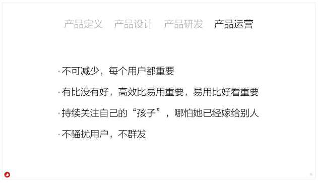

**第一点，不可减少，每个用户都重要。**

**新产品不能比老产品的功能少，不应该轻易下线产品功能，不降低服务，不让少数服从多数，每个用户的需求和习惯都是重要的。**

就是我前面讲到的， to.B 的产品不接受你把一个功能下线，永远不要去减少你的东西。

**第二点，先有，再高效，然后易用，最后好看。**

**有是最基础的体验，有总比没有要好。然后使用效率要很高，再然后才是要好用易用，最后才是要好看。当然，丑也是不行的。**

有是最基础的体验，这个功能有没有？先要有，然后要高效。因为你做的是一个商家工作台，他使用效率要很高，然后才是要好用，要易用，上来就能用，上来就会用，然后才是要好看。

to.B 的产品不应该是上来搞好看，没用的。我们不需要那么好看的商家后台界面，简洁是最重要的，所以我们左右导航且颜色都是灰的，不要搞那么跳（饱和度很高）的颜色，商家后台不需要那么跳，黑白灰配一些色，让它舒服一点就好了，当然“有赞美业”可以特殊，美业本来就很时尚，但是美业也不要用大红那么跳的颜色，这是基本的。好看没有好用重要，好用没有高效重要，因为它是商家后台，天天都在用，他学习一下未来效率高很重要。高效没有有重要，先要有。

（问：高效和易用有什么区别？

答：高效，指的是长期使用效率；易用通常指的是用户是否容易学习容易上手。举个例子：我们做水电煤缴费，每个月用一次，每次用都忘了上次学习的操作技能，那么应该注意“容易学习容易上手”，符合“别让我思考”的逻辑，宁愿多点一次也别让他多想；我们做商家后台“发货”和“收银”功能，每天都用，用很多次，应该注重“使用效率高”，即使要学习一下，也得保证可以高效操作，不要每次都要点 N 多回才能完成一个操作）

**第三点，持续关注自己的“孩子”，哪怕她已经嫁人。**

**作为一个产品人，应该持续关注自己做过的产品，哪怕这个产品已经不归自己管了，也应该经常关注并思考她的发展和进化。**

我觉得这是任何一个产品人都应该有的基本精神，你既然做了一个产品，这个产品就是你的孩子，你就应该持续关注她，哪怕这个产品你做完了，你不再负责了，转到别的部门了，别的人在负责，你都应该时不时的去看看她。因为你做出来的产品就是你的孩子，如果你的女儿嫁人了，你是不是就不联系她了？不会吧。所以就是这样。

我很负责任的说，我做过的支付宝产品、百度的产品，到现在我偶尔还想回去看看她，看看她被改成什么样子了。我觉得我骨子里至少还有那种精神，这是一个产品人最基本最基本的精神。

**第四点，不骚扰用户，不群发。**

**我们的责任是帮助商家成功，不是为了让我们自己的生意更成功，我们没有权利去为了自己的商业目的不断骚扰用户。用户通常不看系统消息，群发信息起不到沟通作用。**

在这家公司里，任何给用户群发信息都必须我批准，而我不会有时间审批，发邮件我看都不会看，你发微信我也不会理你的。如果你非得说不发会死，会出现大问题，那么自己想办法找我，找的第一次我理都不理你，因为你不要给商家发信息，人家用你的后台做生意，你没事给他群发啥信息呢？为什么要去骚扰他？你的责任是帮助他的生意更成功，你的责任不是为了让你的生意更成功（可以去骚扰他）。

还有些基本的常识，没有在我们的原则里。但是我会发现有一些新的产品经理，或者在别的没有底线的公司做过产品的人带来了一些恶习，这些基本的常识我把它重复强调一下，我不认为这是我们的特殊原则。上面十三条很多是我们的特殊原则，不是全行业通用的，剩下内容是一些做产品要有的基本常识。

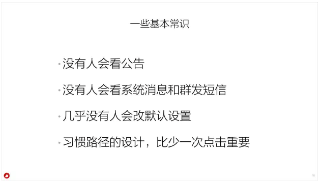

**第一点，没有人会看公告。**

你要清楚，没有用户会看公告，你不要搞一个产品改完了公告上完了就结束了，然后商家说这怎么改了？你理直气壮的说我发过公告呀。商家不会看公告的，没有用户会看公告，不要依赖公告告诉用户你的产品变了，发生了什么变化，你要用你的产品设计能力让他感受到你发生了什么变化。（当然，也别傻乎乎的在产品上专门搞个图层提醒他“我变了，看到没”，你要知道在你的新用户眼里不存在“变了”，你就是他的第一眼）

**第二点，没有人会看系统消息和群发短信。**

不要觉得你上线了一个改变了的东西，或者你改变了一个政策，群发一条系统公告问题就解决了，解决不了，基于用户体验他就不知道去看你发的信息。当然有的时候法律上需要，你可能还是得发，但是基于用户体验设计，你不要以为你发了他就会看，他不会看公告的，他不会看系统消息的，他也不会看你群发消息的，你的产品让用户感知到改变不要靠这些，没有用，他不看。

**第三点，几乎没有人会改默认设置。**

这也是最基本最基本的素养，我经常听大家讨论产品，讨论着讨论着说，哎呀，到底通常他们更多人会用 A 呢？还是用 B 呢？默认该用 A 呢还是该用 B 呢？突然有一个人冒出来说：没关系，加个高级设置，让他可以从 A 设置到 B 。（这么做并不能解决问题）

几乎没有人会改默认设置的，只有高级用户会改，所以当你的一个产品模式有 N 种设置的时候，你一定要花最多精力去想默认设置该是哪一个？因为你默认是什么样他就会那么用。举个例子：我们最早为了强调有赞担保很重要、很特殊，有赞担保上线的第一版，我们用了一个绿色的底，丑的要死。然后就有人说我们做一个白色的底，不那么丑的，商家可以去改设置。常识告诉我们商家是不会改默认设置的，所以我们把默认设置改成白色，如果有商家觉得提醒别人有赞担保特别重要，他要改成带颜色的底，他可以去改设置，高级商家可以去改，默认新店都是白色的底。

但是我们并没有把老店铺改过来，因为商家是独立的，你默认绿色的底他用了，你就没有权利帮他改成白色，即便几万个商家里面只有 10 个商家喜欢绿色，你凭什么给他改成白色？所以我们要想办法告诉几万个商家“这个有点难看，你可以把它改成更好看的颜色”，而不是强行把它改了，你没有权利不能私自去改他的东西也是基本原则。所以默认设置非常非常重要，你一定要花最多的精力去想，这个东西有三个设置默认设置成哪一个？非常非常重要，但是这件事不是所有产品人都具备这样的素养。

**第四点，习惯路径的设计，比少一次点击重要。**

绝大部分做产品的人都看过那本书，中文名叫《点石成金》，英文名叫 《Don’t make me think》 ，书中说可以多点一次，每次都不需要思考，这是基本原则。所以少点一次多点一次没那么重要，重要的是让他形成习惯路径。

举个例子：微信不需要把“朋友圈”拉到一级导航。虽然你进朋友圈的频率那么高，你每次进朋友圈点击“发现”再点进朋友圈，但是微信就是不会拿到一级导航。因为这样会给发现里面的其他频道带来很大的流量和商业价值，反正养成了用户习惯，用户体验有没有损失？有一点点，只一点点损失，可以接受。

我们有很多很多产品是一样的，比如说切换店铺，很多人习惯把重要的东西都摆到首页，跟摆地摊似的，如果有一万个功能呢？怎么摆。所以，你要设计他的使用习惯。

我们已经设计了有赞商家的两大流量入口，一个流量入口是概况页，很多重要的、常用的东西放在那，那是个工作台。还有一个入口我们已经慢慢把它养成了，就是应用市场。我们有这两个流量入口就可以让很多商家去发现一些东西，他可能不会点到订单再点到里边去，他会在首页直接点待发货订单然后进去发货。

你要设计好他的路径，这个路径的设计还包含如果你在首页上放的是广告位，那个广告位一定要更新，如果你不更新，他就把那个广告位当成一个导航用了，商家不会觉得只有左边那个我们叫导航的东西是导航，他不会那么认为的，如果广告位总不更新，运营的位置总不更新，以后就不要更新了，因为他会把那个位置当成他的导航。

再举个特别有意思的例子，早年我在百度的时候，阿里巴巴的很多用户，是在百度上随便搜索一个词，点百度右边的广告“找什么什么去阿里巴巴”，然后进阿里巴巴，他永远都那么进，其实那就是他的习惯路径，这个路径依赖性非常非常强。

所以如果你能让他养成习惯路径，就可以让他多点一下，没关系，这是最基本最基本的常识。

最后，以上每一条原则我们希望每个人都要熟悉起来。接下来的新人，需要通过这些产品设计原则的考试才能转正。

中国实在太少的企业服务公司了，所以我们这个行业能够彻底站在商家或者企业角度思考的人也不多。希望有赞的《产品设计原则》是一个开始，能够帮助到更多这个行业的产品人，因为我坚信：未来五年，中国最好的企业服务产品经理绝大部分都坐在这里。当然，我们还是非常缺产品经理和体验设计师，电商、零售、教育、美业、营销、交易、会员、数据、支付、金融、云、中台、风控、广告等方向都缺，如果遇到优秀的产品经理和体验设计师可推荐，请大家把简历直接给到麦麦。（邮箱：**joinus@youzan.com**）

我也坚定的认为未来三到五年，整个中国的商家都需要升级他们的经营系统，尤其是深度拥抱互联网。那么，这个行业最缺的就是需要人给他们提供足够好的产品，需要能够真正站在商家角度思考，真正有企业服务视野的产品人。所以，在座的各位一定会成为未来这个行业最值钱的人。

恭喜大家，也谢谢大家一起创造了这些。

白鸦

2019.06.20 杭州
