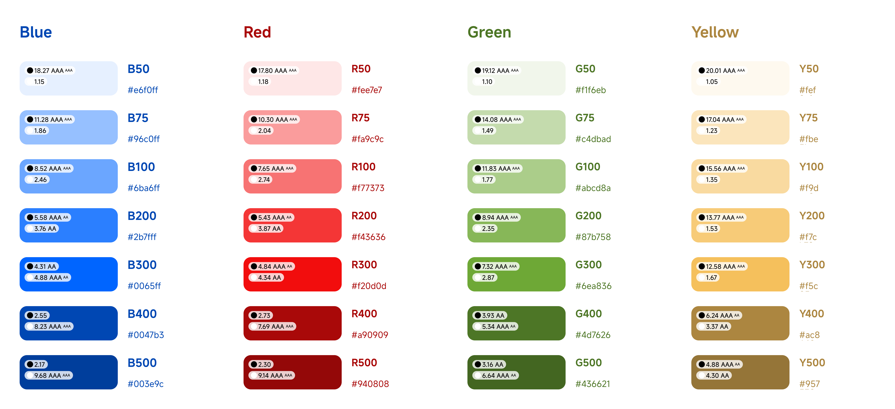

# 色彩层级
本章将深入讨论 Design Token 中关键的色彩体系。我将围绕**色彩层级**、**命名规范**、**设计交付**三个方面进行详细探讨。

## 划分层级的必要性
通常，UI 设计以十六进制色值（如#F5F5F）为元素上色，但存在以下问题：

1. **色彩混乱**：个人色彩感知差异导致实际色值不同，引发整体视觉混乱。每个人有自己的色彩感觉，没有规范的颜色参考，每个人使用的颜色即使在视觉上差异不大，但实际调用的色值可能出现不同。比如，#F5F5F5 和 # F5F5F9，从视觉上很难看出什么区别。但恰是由于这种看似一致，实际不一致的颜色标号，随着设计工程越来越复杂，最终必然导致页面与页面间，场景与场景间，整体视觉的混乱；
2. **灵活性差**：项目上线后，难以在紧急场景中灵活调整设计。
3. **扩展性差**：业务越复杂，越要求颜色表达统一、规范，无层级或单一层级难以满足复杂业务需求。

因此出于视觉统一和灵活维护的考虑，设计体系中，颜色的使用既要遵循一定的约束规则，也要在约束的基础上，保证设计扩展的灵活性，以实现其能支撑各类场景。实现这一目的的手段就是对颜色进行分层。

## 如何划分层级
## 第一层：base color
这一层主要是从海量颜色中，选出我们常用的颜色值，我们称为基础色值。我们需要对基础色值按一定规范，构建颜色梯度，创建常用色卡（如图）。

在这一层中，我们设定不同的 token 和对应的基础色值，构成了基本色库；

在 token 的命名方式上，以简练表达为主，不同梯度之间建议以 100 或 1000 进行划分。比如，对红色卡，token 为 red，不同梯度用red-100、red-200...区分。

| token | 变量值（基础色值）|
| ------- | ------- |
| red-100  | #FEE0D8  |
| red-200  | #FDBAB2  |
| red-300  | #FB8D8B  |
| red-400  | #F86E78  |
| red-500  | #F43F5E  |
| red-600  | #D12E59  |

## 第二层：场景命名
这一
这一层
