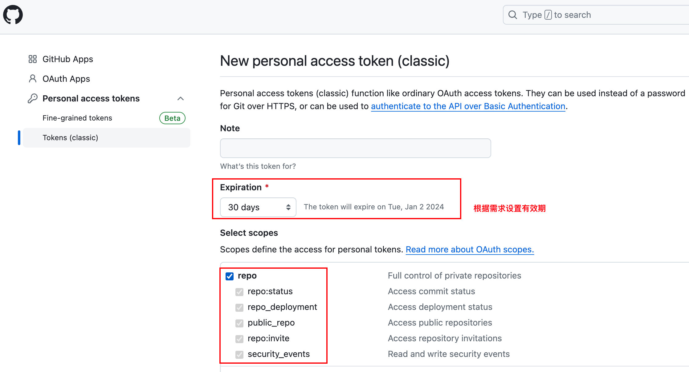
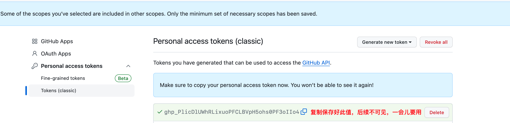
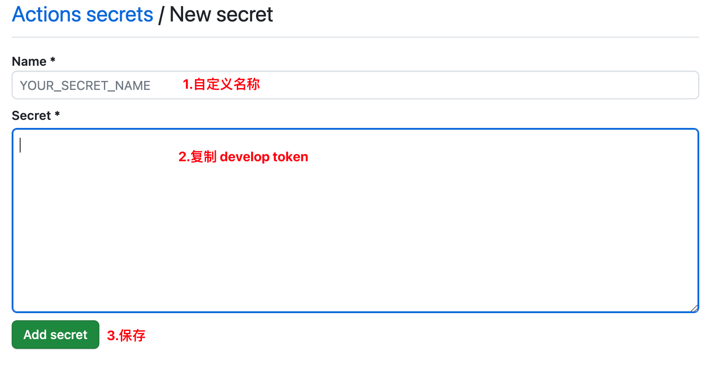
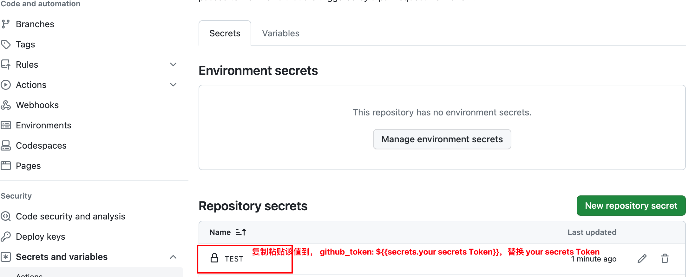
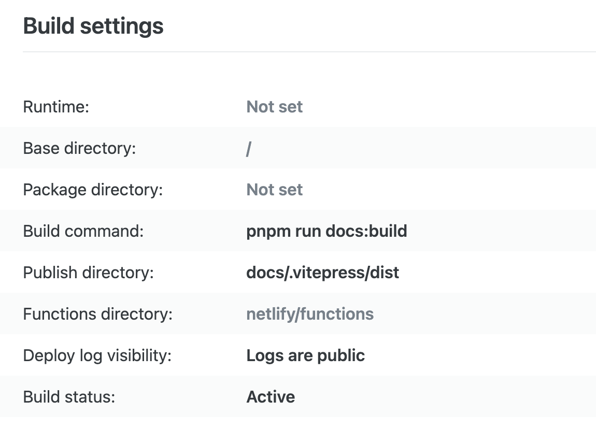
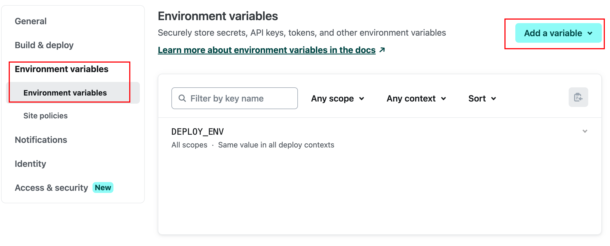

# 线上自动化部署
## 简要说明
本文主要用于记录如何在 github、vercel 和 netlify 上部署静态博客项目。最大的好处是无需服务器即可搭建网站，维护和运营成本较低。

**自定义域名托管服务比较**

以下是一些常见的自定义域名托管服务的比较，包括 Github Pages、Gitee Pages、GitLab Pages、Netlify、Vercel 和 Cloudflare Pages：

| 名称               | 自定义域名 | 限制              | 缺点                               |
| ------------------ | ---------- | ----------------- | ---------------------------------- |
| Github Pages       | 支持       | 空间1G，100G/月    | 国内访问慢，百度不收录              |
| Gitee Pages        | 收费       | 空间1G，100G/月    | 需实名，仓库审查                    |
| GitLab Pages       | 支持       | -                 | 国内访问慢                         |
| Netlify            | 支持       | 100G/月           | 从 GitHub、GitLab、BitBucket 拉取  |
| Vercel             | 支持       | 100G/月           | 从 GitHub、GitLab、BitBucket 拉取  |
| Cloudflare Pages   | 支持       | -                 | 从 GitHub、GitLab 拉取             |

请注意，每个服务都有其独特的优势和限制。选择合适的服务取决于您的项目需求、性能要求和个人偏好。在做决定之前，建议仔细评估每个服务的特点。
## 部署到 Github Page 服务
### 创建 Github 仓库
这一步比较简单，直接在 [Github](https://github.com) 官网操作即可，该仓库用于存放项目文件，这里就不再赘述了。
### 利用 GitHub Actions
GitHub Actions 是 GitHub 提供的一种自动化工作流服务。

首先在项目根目录下，创建 `.github/workflows/vitepress.yml`，这是 GitHub Actions 的配置文件，用于定义和配置 Vitepress 项目的自动化工作流。

该 YAML 文件主要包含了一系列指令和步骤，这些指令和步骤描述了 GitHub Actions 应该如何执行构建和部署 Vitepress 项目。

以下是我的 `vitepress.yml` 配置文件供你参考。将仓库名和仓库路径填入 `vitepress.yml` 中。

``` yml
name: GitHub Actions Build and Deploy

on:
  # 设置执行 GitHub Actions 的触发条件，当前为推送到 main 分支时触发构建
  push:
    branches:
      - main

jobs:
  build-and-deploy:
    runs-on: ubuntu-latest #指定服务器的运行环境：最新版本 ubuntu
    steps:
      # 设置 GitHub Actions 中设置环境变量
      - name: Set DEPLOY_ENV
        run: echo "DEPLOY_ENV=GH_PAGES" >> $GITHUB_ENV
      # 使用 actions/checkout@v4 库拉取代码到 ubuntu 上
      - name: Checkout
        uses: actions/checkout@v4
        with:
          # 根据网上资料查询此处可以设置为 false。https://github.com/actions/checkout
          persist-credentials: false

      # 安装 pnpm
      - name: Install pnpm
        uses: pnpm/action-setup@v2
        with:
          version: 8

      # 设置 node 的版本
      - name: Use Node.js
        # 使用 actions/setup-node@v3 库安装 nodejs，with 提供了一个参数 node-version 表示要安装的 nodejs 版本
        uses: actions/setup-node@v3
        with:
          node-version: "18.x"
          cache: "pnpm"

      # 打包成静态文件
      - name: Build
        run: pnpm install && pnpm run docs:build

      # 部署到 GitHub Pages - 也就是将打包内容发布到 GitHub Pages
      - name: Deploy
        uses: peaceiris/actions-gh-pages@v3
        # 自定义环境变量
        with:
          github_token: ${{secrets.your secrets Token}}
          publish_dir: ./docs/.vitepress/dist # 请根据您的实际情况调整路径
          # 指定仓库：你要发布的仓库路径名
          repository-name: Your repositories/Your project
          # 部署到 deploy-pages 分支，也就是部署后提交到那个分支
          branch: deploy-pages
          # 填写打包好的目录名称路径，本项目配置在根目录
          folder: dist
```
每次你更新代码后，系统会自动给你打包上传并部署

### 设置 your secrets Token
上面 `vitepress.yml` 需要用到 `secrets Token`，按以下步骤创建即可。
1. 生成 `DeveloperToken`
   
   首先进入个人账户 setting 设置页面，点击 Developer settings，选择 Personal access tokens-Tokens （classic），创建 `token`。
   这里要设置有效期和仓库读写权限。

   

   注意，创建完成后，记住这个值

   
2. 设置 `Actions secrets`
   
   首先进入仓库 setting 页面，点击 Secrets and variables，选择 Actions，点击 New repository secret 进行创建。

   
3. 将生成的 `Repository secrets`, 替换 `your secrets Token`

   

### 推送项目到仓库
1. 创建 `.gitignore` 文件
   
   在根目录下创建 `.gitignore` 文件，忽略特定文件夹，不上传到仓库。参考
   ```
   node_modules/
   dist/
   pnpm-lock.yaml
   ```
2. 初始化本地仓库
   
   打开终端（命令行界面），进入你的项目目录，并执行以下命令初始化本地仓库：
   ```sh
   git init
   ```
3. 添加远程仓库地址
   
   执行以下命令，将你的远程仓库地址添加为本地仓库的远程地址：
   ```sh
   git remote add origin https://github.com/YourRepositoriesAddress.git
   ```
   注意，请替换 `YourRepositoriesAddress` 为你的实际仓库地址。
4. 添加文件，提交变更（依次执行）
   
   ```sh
   git add .
   git commit -m "Initial commit"
   ```
5. 推送到远程仓库
   
   执行以下命令，将本地仓库的内容推送到远程仓库：
   ```sh
   git push -u origin main
   ```
   如果你的默认分支是 `main`，如果是其他分支，请将上述命令中的 `main` 替换为你的默认分支名称。
   以上步骤完成后，你的项目文件就会被推送到 GitHub 仓库中。之后，GitHub Actions 就会开始执行你配置的构建和部署任务。如果一切顺利，你的 VitePress 项目就会成功部署到 GitHub Pages。

### 设置 GitHub Pages 服务
进入项目仓库 setting 设置页，点击 pages，选择 branch 分支，根据我们的设置，部署完成后，项目生成的静态文件会存放到 gh-pages 分支下，因此需要将分支更改为 gh-pages。点击 save 保存。

至此，刷新页面，则生成了网站地址，可以进行访问了。也可以根据自己需要，自定义自己的域名。

### 常见问题
1. 访问网站发现样式丢失
   
   这种情况需要检查你项目下，docs/.vitepress/config.mjs 文件。调整 base 的值。
   ```mjs
   import { defineConfig } from 'vitepress'
   export default defineConfig ({
    base: '/YourRepositoryName/',  // 在 GitHub Pages 上部署时的基本路径
    })
   ```
## 部署到 Vercel
[Vercel 官方地址](https://vercel.com/)

在 Github 中新建一个仓库，然后将自己的博客系统代码提交到仓库中，这一步相信大家都会操作我就不重复了吧。在这一步将代码提交到 Github 的目的就是与 Vercel 关联，项目在 Vercel 中部署之后以后更新你的博客内容只需要将代码提交到 Github 中，然后 Vercel 就能实现自动部署。
1. 首先需要使用你自己的 Github 账号来登录 Vercel
2. 点击新建项目来添加 Github 中的项目，选择对应的项目
3. 点击导入按钮来导入要部署的项目
4. 部署的配置一般使用默认的就行，输出的目录要改一下 `docs/.vitepress/dist`
5. 点击部署按钮开始部署等一会儿就部署好了，只要你在本地运行 `pnpm run docs:build` 命令能够打包成功那么部署也基本上没有问题的
6. 部署成功之后 Vercel 会给你分配一个默认的域名，通过这个域名就能访问到自己的博客网站

## 部署到 Netlify
[Netlify 官方地址](https://netlify.com/)

使用 netlify 进行部署，和 vercel 基本一致，也要注意是否需要配置环境变量。
netlify 需要手动填写配置命令，示例
```
pnpm run docs:build
docs/.vitepress/dist
```


## 环境变量问题
为了同时支持 Vercel、Netlify 和 GitHub Pages，您可以采取一些通用的配置策略，以确保在不同的部署平台上都能够正确地访问您的 VitePress 项目。以下是一些建议：

在 `vitepress/config.js` 或 `vitepress/config.ts` 中，您可以根据部署平台设置不同的`base`：
```mjs
import { defineConfig } from 'vitepress'

export default defineConfig({
  base: process.env.DEPLOY_ENV === 'VERCEL'
    ? '/wikipie/'  // 在 Vercel 上部署时的基本路径
    : process.env.DEPLOY_ENV === 'NETLIFY'
      ? '/'  // 在 Netlify 上部署时的基本路径
      : '/wikipie/',  // 在 GitHub Pages 上部署时的基本路径
  // 其他配置...
})
```
在上述示例中，我们使用了一个名为`DEPLOY_ENV`的环境变量，通过这个变量的值来确定部署环境。您可以在 GitHub Actions、Vercel 和 Netlify 中设置这个环境变量。

**在 GitHub Actions 中设置环境变量：** 在您的 GitHub Actions workflow 文件中添加一个步骤来设置环境变量。
```yaml
jobs:
  deploy:
    runs-on: ubuntu-latest

    steps:
      - name: Set DEPLOY_ENV
        run: echo "DEPLOY_ENV=GH_PAGES" >> $GITHUB_ENV
```

**在 Vercel 中设置环境变量：** 在 Vercel 控制台的项目设置中，找到 "Build & Development Settings" 部分，添加一个名为`DEPLOY_ENV`的环境变量，并设置其值为`VERCEL`。

**在 Netlify 中设置环境变量：** 在 Netlify 控制台的项目设置中，找到 "Build & Deploy" 部分，添加一个名为 `DEPLOY_ENV`的环境变量，并设置其值为`NETLIFY`。



这样，通过在不同的部署平台上设置不同的`DEPLOY_ENV`环境变量，您的 VitePress 项目就可以在不同的环境中正确地设置`base`，以支持各种部署方案。
